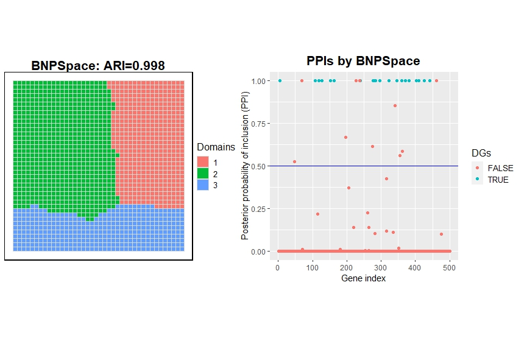

## BNPSpace

### Overview

BNPSpace is a Bayesian nonparametric spatial clustering framework with feature selection for spatial transcriptomic data. This framework integrates four components into a hierarchical model. Firstly, it employs a multivariate count-generating process based on the zero-inflated Poisson (ZIP) model for directly modeling SRT count data, thereby avoiding the need for *ad hoc* data normalization methods. Secondly, BNPSpace adopts a feature selection strategy to provide low-dimensional representations of SRT data in terms of a list of discriminating genes (DGs), thus facilitating direct biological interpretability. Distinctively, BNPSpace clusters samples based on the similarity of their DG count vectors using a mixture of finite mixtures (MFM) model, allowing for an automatic selection of the number of spatial domains. Moreover, BNPSpace uses an MRF prior to accounting for the geospatial profile of SRT data, which in turn enhances clustering accuracy. 

### User manual

The required R packages:

* Rcpp
* SingleCellExperiment
* RcppArmadillo
* flexclust

The data structure used for BNPSpace is a `SingleCellExperiment` object containing assay "counts" and col data "row" and "col". "row" and "col" are the coordinates of each spot. 

```R
source("demo/dataSim.R")
> sce
#class: SingleCellExperiment 
#dim: 500 1600 
#metadata(0):
#assays(2): counts logcounts
#rownames(500): gene_1 gene_2 ... gene_499 gene_500
#rowData names(0):
#colnames(1600): spot_1 spot_2 ... spot_1599 spot_1600
#colData names(4): row col label sizeFactor
#reducedDimNames(1): PCA
#mainExpName: NULL
#altExpNames(0):
```

The above simulation data contains two assays, original counts data and log-normalized data (logcounts). There are 500 genes and 1600 spots. PCA represents the dimension reduction features using principal component analysis. The col data names "row" and "col" are spatial coordinates, "label" is the cluster ground truth, and "sizeFactor" is the size factor of each spot.

Then, we can run BNPSpace.

```R
library(Rcpp)
library(SingleCellExperiment)
library(RcppArmadillo)
library(flexclust)
source("R/utils.R")
source("R/main.R")
### construct spots network
Adj = find_neighbors(sce, "ST", "image")
neighbors = find_neighbor_index(Adj, "ST")
result = NSCFS(sce, neighbors, n_clusters = NULL, d = 1, n_iters = 500, seed = 1)
pred_label = result$pred_label
ARI_value = randIndex(table(pred_label, colData(sce)$label))
```

Finally, we draw the clustering results and feature selection results. 

```R
library(BayesSpace)
metadata(sce)$BayesSpace.data <- list()
metadata(sce)$BayesSpace.data$platform <- "ST"
metadata(sce)$BayesSpace.data$is.enhanced <- FALSE
p <- clusterPlot(sce, label= pred_label, palette=NULL, size=0.05) +
  labs(title=paste0("BNPSpace: ARI=", round(ARI_value, 3)), fill = "Domains") + 
  theme(legend.key.size = unit(0.5, 'cm'), 
        legend.key.height = unit(0.5, 'cm'), 
        legend.key.width = unit(0.5, 'cm'), 
        legend.title = element_text(size=12), 
        legend.text = element_text(size=10),
        panel.border = element_rect(colour = "black", fill=NA, size=1),
        plot.title = element_text(size = 16, face = "bold", hjust = 0.5))

data_gamma = data.frame(gene = sample(500), gamma_est = result$gamma, gamma_true = c(rep(TRUE, 20), rep(FALSE, 480)))

library(ggplot2)
PPI_plot = ggplot(data = data_gamma) + geom_point(aes(x = gene, y = gamma_est, color = gamma_true))+
  ylab("Posterior probability of inclusion (PPI)") + xlab("Gene index") + 
  labs(title = "PPIs by BNPSpace", color = "DGs") +
  geom_hline(aes(yintercept = 0.5), color = "blue") +
  theme(legend.key.size = unit(0.5, 'cm'), 
        legend.key.height = unit(0.5, 'cm'), 
        legend.key.width = unit(0.5, 'cm'), 
        legend.title = element_text(size=12),
        legend.text = element_text(size=10),
        plot.title = element_text(size = 16, face = "bold", hjust = 0.5))
library(patchwork)
p + PPI_plot + plot_layout(nrow = 1)
```



### Tutorials

For a tutorial on a real application, please refer to  [Tutorial.html](https://new-zbc.github.io/BNPSpace/Tutorial.html) 

If there is any bugs without being fixed timely, please contact author directly [zhubencong@gmail.com](mailto:zhubencong@gmail.com)
